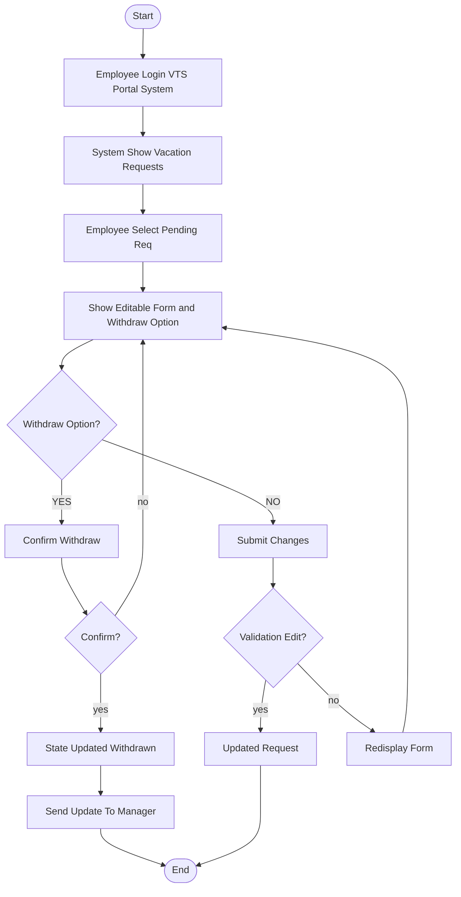
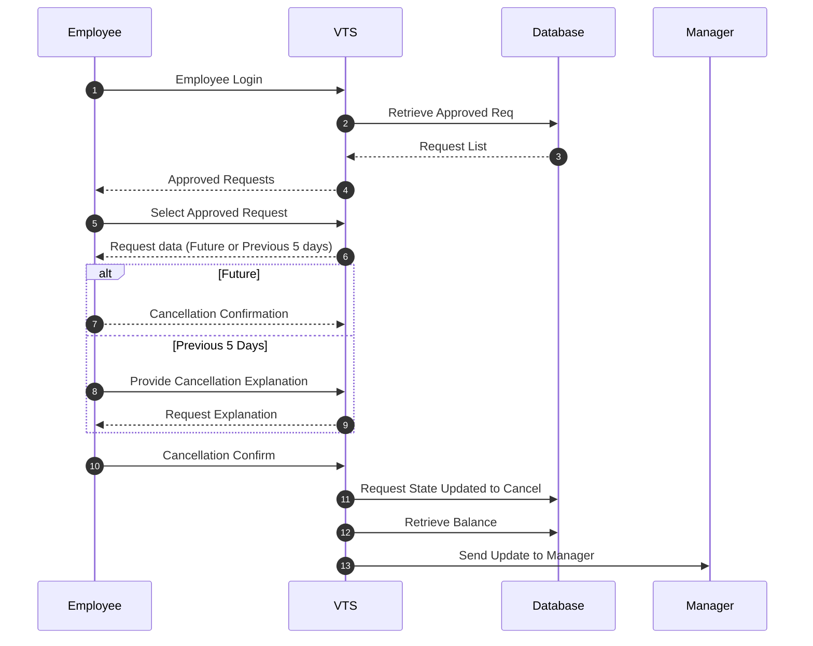

# Use Case: Cancel Approved Vacation Request

## Goal
Allow an employee to cancel a future or previously approved vacation request.

## Actor
- **Employee**

## Preconditions
- Request status is **Approved**  
- Vacation is **upcoming** or occurred within the **last 5 business days**  
- Employee is **authenticated**

## Main Flow
1. Employee opens the **Vacation Tracking System (VTS)** home page.  
2. System displays all vacation requests and the employee's vacation balance.  
3. Employee selects an approved request scheduled for the future or recent past.  
4. System prompts confirmation:  
   - If the request is in the recent past, system asks for a cancellation reason.  
5. Employee confirms cancellation.  
6. System cancels the request and restores vacation hours to the employee's balance.  
7. System sends a notification email to the employee's manager.  
8. Employee is redirected back to the main VTS dashboard.

## Notes
- Only approved requests can be canceled.  
- Vacation hours are automatically restored upon successful cancellation.

## Flowchart 

## Sequence Diagram 

## Paudocode 
BEGIN

    EmployeeLogin(VTS_Portal_System)
    vacationRequests = System.ShowVacationRequests()
    selectedRequest = Employee.SelectApprovedRequest(vacationRequests)
    IF IsFutureDate(selectedRequest.date) OR IsWithinPrevious5BD(selectedRequest.date) THEN
        
    EmployeeConfirmation = Employee.ConfirmCancellation()
    IF EmployeeConfirmation == TRUE THEN
    selectedRequest.state = "Cancelled"
    ReturnBalanceToEmployee(selectedRequest)
    SendUpdateToManager(selectedRequest)
        
        ELSE
    AbortCancellation("Not Confirmed")
    
        ENDIF
        ELSE
    
    Reason = Employee.EnterCancellationExplanation()
    IF Reason IS NOT EMPTY THEN
    selectedRequest.state = "Cancelled"
    ReturnBalanceToEmployee(selectedRequest)
    SendUpdateToManager(selectedRequest)
            
    ELSE
        
    AbortCancellation("Reason Not Provided")

    ENDIF
    ENDIF
    END

